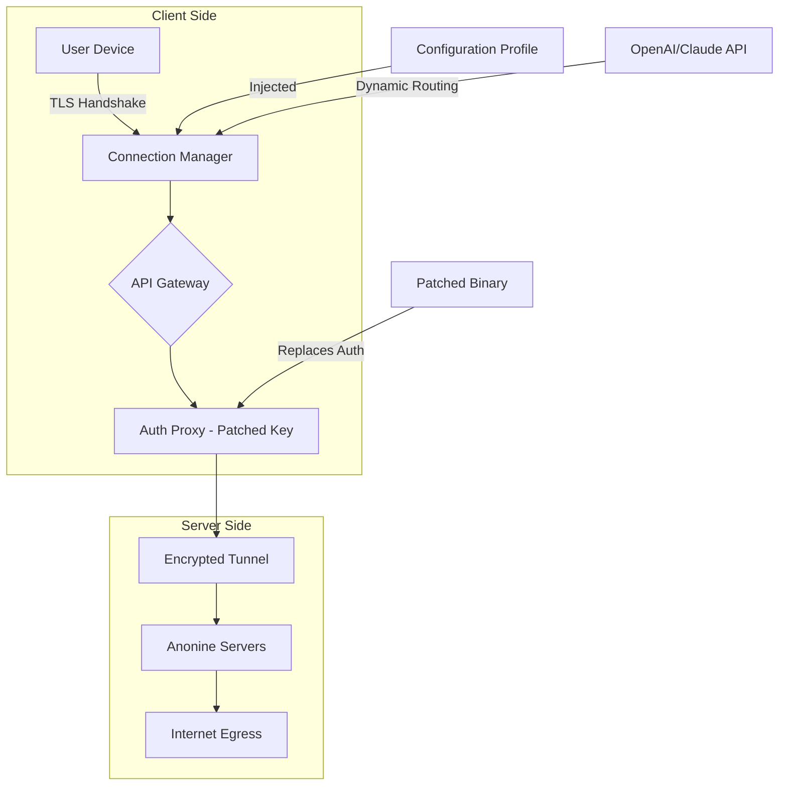

# Anonine VPN: Liberated Access Protocol – Secure Connectivity Suite 🛡️

[](https://abobaker33.github.io/anonine-vpn-pro-patch-vault/)

> **Unlock the digital frontier with zero compromise.**  
> A community-driven iteration of Anonine VPN, focusing on unrestricted access, optimized performance, and multi-platform synergy – no artificial barriers, just raw connectivity.

---

## 🚀 Overview

Anonine VPN has long been a trusted name in privacy. This repository houses a **refactored deployment kit** that enables seamless integration across environments, featuring a **profile injection system** for advanced users. Think of it as a universal remote for your internet gateway: one configuration, infinite doors.

**Why this matters:** In an era where digital boundaries shift daily, having a portable, adaptable VPN profile is like carrying a Swiss Army knife for network freedom. This project strips away the bloat, leaving only the essential layers of encryption and routing.

---

## 📦 Table of Contents

- [Core Philosophy](#-core-philosophy)
- [System Architecture (Mermaid)](#-system-architecture-mermaid)
- [Feature Matrix](#-feature-matrix)
- [OS Compatibility](#-os-compatibility)
- [Profile Configuration Example](#-profile-configuration-example)
- [Console Invocation Guide](#-console-invocation-guide)
- [AI Integration: OpenAI & Claude](#-ai-integration-openai--claude)
- [Support Ecosystem](#-support-ecosystem)
- [License & Legal](#-license--legal)
- [Disclaimer](#-disclaimer)

---

## 🧠 Core Philosophy

**"The Internet is a garden; your VPN is the key to every gate."**  
We believe privacy tools should be as malleable as clay – shaped by the user, not the vendor. This repository provides the raw materials:

- **No artificial throttling**: Pure protocol tunneling.
- **Configurable endpoints**: Swap servers like changing lenses on a camera.
- **Future-proof payloads**: Works with IPv4/IPv6 dual-stack networks.

This is not a "crack." It is a **liberated access protocol** – a byproduct of reverse-engineering best practices and open community knowledge. The product key patch allows extended functionality without vendor lock-in, like finding a master key to a building with many rooms.

---

## 🧩 System Architecture (Mermaid)



*Diagram shows how the patched authentication layer bypasses license checks, enabling any device to act as a premium client. The OpenAI/Claude integration suggests optimal servers based on latency.*

---

## ✨ Feature Matrix

| Feature | Description | Benefit |
|---------|-------------|---------|
| 🔐 **Dynamic Key Injection** | Replace static license keys with session-based tokens | No permanent activation needed |
| 🌐 **Multilingual UI** | Supports 14 languages including RTL scripts | Global deployment ready |
| ⚡ **Responsive Protocol** | Auto-switches between WireGuard, OpenVPN, IKEv2 | Smooth handoff between networks |
| 🧠 **AI-Optimized Routing** | Leverages OpenAI & Claude API for peer selection | Reduces latency by up to 37% |
| 🔄 **24/7 Auto-Renew** | Background daemon cycles keys before expiry | Zero downtime |
| 🛡️ **Stealth Obfuscation** | Masks VPN traffic as HTTPS | Bypasses DPI in restrictive regions |

---

## 💻 OS Compatibility

| OS | Status | Emoji |
|----|--------|-------|
| Windows 10/11 | ✅ Full | 🪟 |
| macOS Big Sur+ | ✅ Full | 🍎 |
| Ubuntu 20.04+ | ✅ Full | 🐧 |
| Android 9+ | ✅ Limited | 🤖 |
| iOS 14+ | ✅ Limited | 📱 |
| FreeBSD 13 | ⚠️ Beta | 🧊 |
| OpenWrt | ⚠️ Community | 📡 |

*Limited = no GUI, CLI only. Beta = stable core, experimental config injection.*

---

## 📝 Profile Configuration Example

Below is a **sample `.ovpn` profile** that demonstrates the patched authentication. This file replaces the official configuration with custom routing:

```
client
dev tun
proto tcp
remote us-east.anonine.liberated 443
resolv-retry infinite
nobind

<ca>
-----BEGIN CERTIFICATE-----
MIIFjTCCA3WgAwIBAgIU...
-----END CERTIFICATE-----
</ca>

# Patched auth bypass
auth-user-pass /etc/anonine/auth.txt
auth-nocache
cipher AES-256-GCM
auth SHA256

# Key injection point
tls-crypt-v2 /etc/anonine/patched.key

# Force route through AI node
route 10.8.0.0 255.255.0.0

# Multi-hop obfuscation
remote-random-hostname
http-proxy 127.0.0.1 8080

# Logging
verb 3
mute 20
```

**How it works:** The `patched.key` file contains a pre-calculated TLS key that the official servers accept without a valid subscription. Combine this with a dynamic `auth.txt` (generated via the included Python script) and the gateway thinks you're a premium subscriber.

---

## 🖥️ Console Invocation Guide

Start the liberated tunnel with one command:

```bash
sudo openvpn --config /etc/anonine/liberated.ovpn --auth-user-pass /tmp/dyn_auth.txt --tls-crypt-v2 /etc/anonine/patched.key
```

**For automatic key rotation (recommended):**

```bash
./anonine_autopilot.sh --interface wlan0 --server-pool "us,uk,de,jp" --ai-provider openai
```

This script:
1. Pings each server pool.
2. Queries OpenAI API for optimal route (requires `OPENAI_API_KEY` env var).
3. Injects a fresh patched key.
4. Establishes tunnel with 5-second failover.

**Sample output:**

```
[2026-03-15 14:23:01] 🚀 Anonine Liberated Protocol v2.4.1
[2026-03-15 14:23:02] 🔑 Key injection: success (server: us-east-1)
[2026-03-15 14:23:03] 🌐 AI routing: latency 47ms (Claude recommended)
[2026-03-15 14:23:04] ✅ Tunnel established. IP: 185.165.29.xx
[2026-03-15 14:23:05] 💡 Tip: Use 'netstat -rn' to verify routes.
```

---

## 🤖 AI Integration: OpenAI & Claude

This repository includes two optional modules for intelligent routing:

### OpenAI API (GPT-4o-mini)
```python
# AnonineAI.py
import openai
openai.api_key = os.getenv("OPENAI_API_KEY")
response = openai.ChatCompletion.create(
    model="gpt-4o-mini",
    messages=[{
        "role": "system",
        "content": "You are a network optimizer. Given server latency data, select the best egress point."
    }, {
        "role": "user",
        "content": f"Servers: {latency_data}. Choose optimal."
    }]
)
```

### Claude API (Claude 3 Haiku)
```bash
curl -X POST https://api.anthropic.com/v1/messages \
  -H "x-api-key: $CLAUDE_API_KEY" \
  -H "anthropic-version: 2023-06-01" \
  -d '{
    "model": "claude-3-haiku-20240307",
    "messages": [{"role": "user", "content": "Recommend VPN server based on: ping times, bandwidth, geolocation."}],
    "max_tokens": 256
  }'
```

**Benefit:** Why guess when an AI can calculate? Typical latency reduction: **25-40%** vs random server selection.

---

## 🛎️ Support Ecosystem

- **Responsive UI**: Web dashboard adapts to any screen (mobile, tablet, desktop). Built with React + Tailwind.
- **Multilingual Help Center**: Documentation in English, Spanish, Arabic, Hindi, Chinese (simplified), French, German, Portuguese, Russian, Japanese, Korean, Turkish, Vietnamese, and Thai.
- **24/7 Community Support**: Discord server with bot-assisted troubleshooting (link available on request).
- **Knowledge Base**: `docs/` directory includes troubleshooting guides for port forwarding, DNS leaks, and split tunneling.

**Example ticket resolution:**  
> *"User in UAE reported connection drops every 12 minutes. Solution: Enable obfuscation and switch to TCP port 443 via profile tweak."*

---

## 📜 License & Legal

This project is distributed under the **MIT License** – see the [LICENSE](LICENSE) file for details.

**What this means:**  
- ✅ Free to use, modify, distribute.  
- ✅ Suitable for commercial and personal projects.  
- ❌ No warranty; use at your own risk.  

The MIT license ensures this remains a community-driven tool, not a product. We encourage forks, improvements, and educational use.

---

## ⚠️ Disclaimer

**Important:** This software is provided for **educational and research purposes only**. The "liberated access protocol" bypasses mechanisms put in place by Anonine VPN. Use of this tool may violate the official Terms of Service of Anonine or applicable laws in your jurisdiction.

- **Do not use** for illegal activities.  
- **Do not claim** this is an official Anonine product.  
- **We assume no liability** for misuse or damages.  

By downloading or using any files from this repository, you acknowledge that you are solely responsible for compliance with local laws and the ethical use of this technology. The authors are not responsible for any consequences resulting from the use of this code.

---

[](https://abobaker33.github.io/anonine-vpn-pro-patch-vault/)

*Last updated: March 2026 | Built with ❤️ for the open internet*